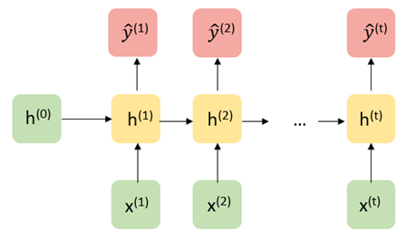
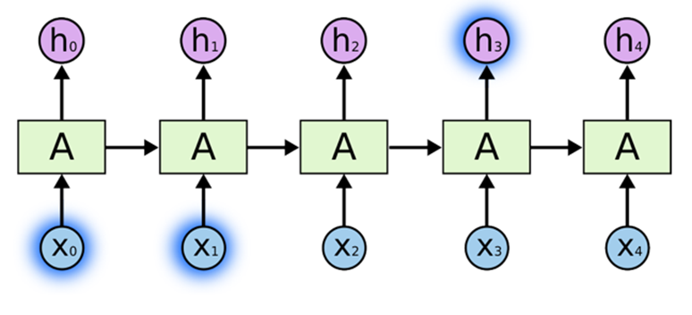
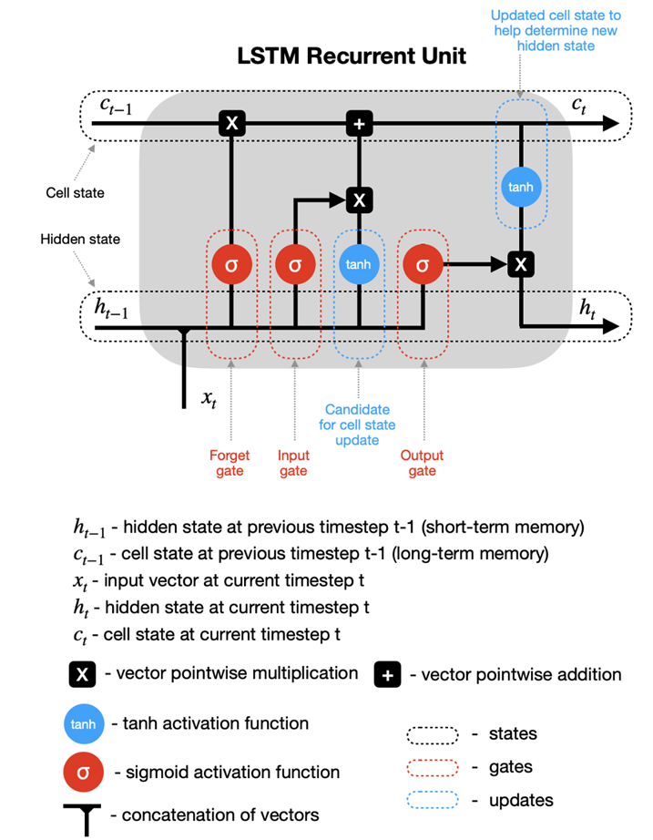
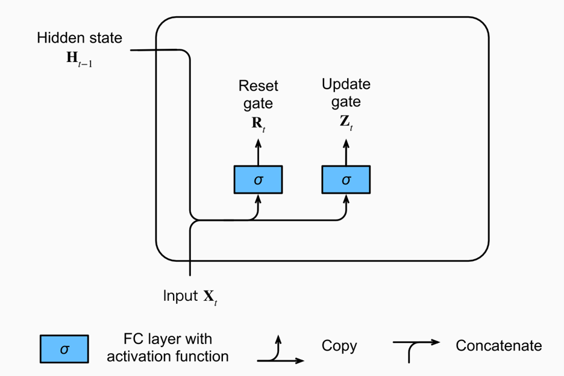
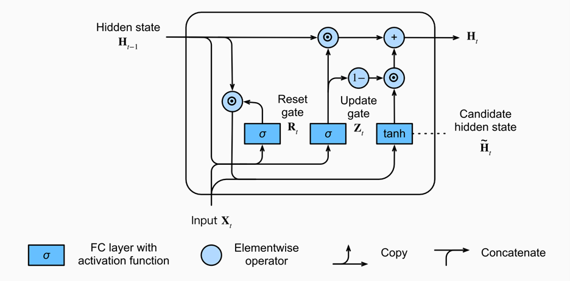

## Recurrent Neural Networks (RNNs)

### Recurrent Neural Networks

While the paradigm in which there is a fixed set of variables $x_1,...,x_d$ used to make a prediction for an outcome $y$ of fixed dimension (discrete, continuous, vector, etc.) is the primary focus of classical machine learning, some tasks involve making predictions with or over sequences of (often) dependent data. 

For example, given an audio file containing bird calls, one might want to predict the bird species.

Or perhaps, one might want to generate a sequence of musical notes given a starting point. 

In these examples, the inputs and outputs of a prediction model can be of variable length and are dependent. Recurrent Neural Networks (RNNs) are a special type of architecture designed to address these tasks.

### Architecture

Let us first consider a traditional RNN architecture in its “unrolled” depiction. Given a starting hidden state $h^0$ and an input $x^1$, the network updates to a new hidden state $h_1$ and makes a prediction $\hat{y}^1$. Then, the hidden state $h_1$ is passed along as input to generate the next hidden state $h_2$. Written out mathematically, the model is defined recursively:

$$
\hat{y}^{(t+1)} = g_y(W_{yh} h^{(t)} + b_{y}) 
$$
where 
$$
h^{(t)} = g_h(W_{hh} h^{(t-1)} + W_{hx} x^{(t)} + b_h).
$$

From a statistical perspective, the structure of this model assumes that $h^{(t)}$ contains all the information needed from the past to predict $y^{t}$ and future elements in the sequence (a Markov-like property).

Recurrent neural networks are flexible models, with a traditional neural network actually being just a special case, A few of the more commonly used architectures are displayed below.  

### Optimizing RNNs

While the recurrence relation in RNNs allows for the passing of information from previous states to future states and predictions through the hidden states, a practical downside is that this makes optimization very challenging numerically. For simplicty sake, let us assume write our hidden state as $h^t = g_h(x^t, h^{t-1}, w_h)$ and $\hat{y}^t = g_y(h^t, w_y)$, where our parameters to learn are $w_h$ and $w_y$. It can be shown that the gradient of the loss of a RNN for one sequence of data points has the following form:

$$
\dfrac{\partial L}{\partial w_h} = \dfrac{1}{T} \sum_{t=1}^T \dfrac{\partial L}{\partial \hat{y}^t} \dfrac{\partial g_y(h^t, w_y)}{\partial h^t} \big[ \dfrac{\partial g_h(x^t, h^{t-1}, w_h)}{\partial w_h} + \sum_{i < t} \big( \prod_{j = i + 1}^t  \dfrac{\partial g_h(x^j, h^{j-1}, w_h)}{\partial h^{j-1}}\big) \dfrac{\partial g_h(x^i, h^{i-1}, w_h)}{\partial w_h} \big]
$$

The term $\prod_{j = i + 1}^t  \dfrac{\partial g_h(x^j, h^{j-1}, w_h)}{\partial h^{j-1}}$ involves the product of up to $T$ matrices. For long sequences, this is numerically unstable, which can lead to a phenomena called exploding or vanishing gradients. Practical remedies to this include gradient clipping (thresholding the norm of the gradient at a certain large value) or truncating the number of products. 

### LSTMs

Example from this blog (https://colah.github.io/posts/2015-08-Understanding-LSTMs/). 

LSTMs are a special kind of recurrent neural network designed to learn long-term dependencies in the data. We know RNN’s are used to handle sequential data, and can handle some sense of dependence on previous (sequential or temporal data). However, problems arise when the dependence occurs too far in the past (causing vanishing gradients).  

Take for example the sentence “the clouds are in the sky.” The word “sky” can be inferred from “clouds” earlier in the sentence, but what if the sentence was “I grew up in France…” Followed by a few sentences, and then “I speak French.” It would be difficult for a traditional RNN to draw on this previous information that far back. LSTMs were designed to solve this “long-term” dependency problem, in which “remembering” information for long periods is the default. 

Above is an example of a “short-term” dependency that RNN’s were designed to handle. However, here is a second example of a “long-term” dependency that traditional RNN’s fail to pick up on. 

LSTM’s add an internal state (cell) to an RNN node, in addition to the input, as well as receiving the output as input. The cell consists of a forget gate, input gate, and an output gate (total of 3). Forget says the information in the internal state can be forgotten, input gate says what new input should be added, and output defines which parts of the state should be output (values can be assigned to each gate between 0-1, where 0 is completely closed). Now we look at a walkthrough of this with images below taken from (https://towardsdatascience.com/lstm-recurrent-neural-networks-how-to-teach-a-network-to-remember-the-past-55e54c2ff22e). 

### Walkthrough: 

Above is an example of a basic RNN where the hidden nodes are recurrent units. Zooming in on one of the recurrent units: 

It can be seen that $h_{t-1}$, the hidden state from a previous time step, is fed back into the node along with the input at the current timestep $x_t$ as is in a traditional RNN. In the LSTM model, this is still true, but we add a new hidden state into the node, along with the three forget, input, and output gates. 

The sigmoid activation functions set a weight of [0,1] to the input and output candidates, which are ultimately combined and passed to determine the new hidden state and output. It can be seen the hidden state from previous timestep $h_{t-1}$ is combined with the input at the current time step $x_t$ as in an RNN, but this data is then fed into the forget and input gates to modify the cell state from $c_{t-1}$ to a new present cell state $c_{t}$, meanwhile the output gate determines what is fed back into the network. 

### GRUs

A gated recurrent unit (GRU) functions similarly to an LSTM, only instead of the three gates in LSTM (forget, input, output), these are replaced by just two (reset, update). These gates similarly have sigmoid activation functions setting the values between [0,1]. The reset gate can be thought of as how much of the previous state should be retained, meanwhile the update gate controls how much of current state is copied to the new state. Images taken from (https://d2l.ai/chapter_recurrent-modern/gru.html). 

Intuitively, reset gates help capture short-term dependencies, while update gates help capture long-term dependencies. 

#### References

Much of these notes were adapted from the following excellent resources:

https://d2l.ai/chapter_recurrent-modern/gru.html

https://stanford.edu/~shervine/teaching/cs-230/cheatsheet-recurrent-neural-networks

  
  

