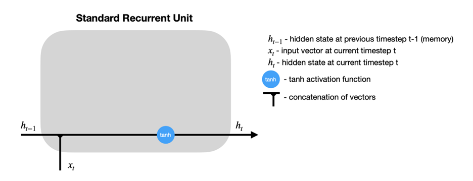

## Recurrent Neural Networks (RNNs)

### Recurrent Neural Networks

While the paradigm in which there is a fixed set of variables $x_1,...,x_d$ used to make a prediction for an outcome $y$ of fixed dimension (discrete, continuous, vector, etc.) is the primary focus of classical machine learning, some tasks involve making predictions with or over sequences of (often) dependent data. 

For example, given an audio file containing bird calls, one might want to predict the bird species.


Or perhaps, one might want to generate a sequence of musical notes given a starting point. 


In these examples, the inputs and outputs of a prediction model can be of variable length and are dependent. Recurrent Neural Networks (RNNs) are a special type of architecture designed to address these tasks.

### Architecture


Let us first consider a traditional RNN architecture in its “unrolled” depiction. Given a starting hidden state $h^0$ and an input $x^1$, the network updates to a new hidden state $h_1$ and makes a prediction $\hat{y}^1$. Then, the hidden state $h_1$ is passed along as input to generate the next hidden state $h_2$. Written out mathematically, the model is defined recursively:

$$
\hat{y}^{(t+1)} = g_y(W_{yh} h^{(t)} + b_{y}) 
$$
where 
$$
h^{(t)} = g_h(W_{hh} h^{(t-1)} + W_{hx} x^{(t)} + b_h).
$$

From a statistical perspective, the structure of this model assumes that $h^{(t)}$ contains all the information needed from the past to predict $y^{t}$ and future elements in the sequence (a Markov-like property).

Recurrent neural networks are flexible models, with a traditional neural network actually being just a special case, A few of the more commonly used architectures are displayed below.  


### Optimizing RNNs

While the recurrence relation in RNNs allows for the passing of information from previous states to future states and predictions through the hidden states, a practical downside is that this makes optimization very challenging numerically. For simplicty sake, let us assume write our hidden state as $h^t = g_h(x^t, h^{t-1}, w_h)$ and $\hat{y}^t = g_y(h^t, w_y)$, where our parameters to learn are $w_h$ and $w_y$. It can be shown that the gradient of the loss of a RNN for one sequence of data points has the following form:

$$
\dfrac{\partial L}{\partial w_h} = \dfrac{1}{T} \sum_{t=1}^T \dfrac{\partial L}{\partial \hat{y}^t} \dfrac{\partial g_y(h^t, w_y)}{\partial h^t} \big[ \dfrac{\partial g_h(x^t, h^{t-1}, w_h)}{\partial w_h} + \sum_{i < t} \big( \prod_{j = i + 1}^t  \dfrac{\partial g_h(x^j, h^{j-1}, w_h)}{\partial h^{j-1}}\big) \dfrac{\partial g_h(x^i, h^{i-1}, w_h)}{\partial w_h} \big]
$$

The term $\prod_{j = i + 1}^t  \dfrac{\partial g_h(x^j, h^{j-1}, w_h)}{\partial h^{j-1}}$ involves the product of up to $T$ matrices. For long sequences, this is numerically unstable, which can lead to a phenomena called exploding or vanishing gradients. Practical remedies to this include gradient clipping (thresholding the norm of the gradient at a certain large value) or truncating the number of products. 


### LSTMs

Example from this blog (https://colah.github.io/posts/2015-08-Understanding-LSTMs/). 

LSTMs are a special kind of recurrent neural network designed to learn long-term dependencies in the data. We know RNN’s are used to handle sequential data, and can handle some sense of dependence on previous (sequential or temporal data). However, problems arise when the dependence occurs too far in the past (causing vanishing gradients).  

Take for example the sentence “the clouds are in the sky.” The word “sky” can be inferred from “clouds” earlier in the sentence, but what if the sentence was “I grew up in France…” Followed by a few sentences, and then “I speak French.” It would be difficult for a traditional RNN to draw on this previous information that far back. LSTMs were designed to solve this “long-term” dependency problem, in which “remembering” information for long periods is the default. 


Above is an example of a “short-term” dependency that RNN’s were designed to handle. However, here is a second example of a “long-term” dependency that traditional RNN’s fail to pick up on. 


LSTM’s add an internal state (cell) to an RNN node, in addition to the input, as well as receiving the output as input. The cell consists of a forget gate, input gate, and an output gate (total of 3). Forget says the information in the internal state can be forgotten, input gate says what new input should be added, and output defines which parts of the state should be output (values can be assigned to each gate between 0-1, where 0 is completely closed). Now we look at a walkthrough of this with images below taken from (https://towardsdatascience.com/lstm-recurrent-neural-networks-how-to-teach-a-network-to-remember-the-past-55e54c2ff22e). 


### Walkthrough: 


Above is an example of a basic RNN where the hidden nodes are recurrent units. Zooming in on one of the recurrent units: 



It can be seen that $h_{t-1}$, the hidden state from a previous time step, is fed back into the node along with the input at the current timestep $x_t$ as is in a traditional RNN. In the LSTM model, this is still true, but we add a new hidden state into the node, along with the three forget, input, and output gates. 


The sigmoid activation functions set a weight of [0,1] to the input and output candidates, which are ultimately combined and passed to determine the new hidden state and output. It can be seen the hidden state from previous timestep $h_{t-1}$ is combined with the input at the current time step $x_t$ as in an RNN, but this data is then fed into the forget and input gates to modify the cell state from $c_{t-1}$ to a new present cell state $c_{t}$, meanwhile the output gate determines what is fed back into the network. 


### GRUs

A gated recurrent unit (GRU) functions similarly to an LSTM, only instead of the three gates in LSTM (forget, input, output), these are replaced by just two (reset, update). These gates similarly have sigmoid activation functions setting the values between [0,1]. The reset gate can be thought of as how much of the previous state should be retained, meanwhile the update gate controls how much of current state is copied to the new state. Images taken from (https://d2l.ai/chapter_recurrent-modern/gru.html). 


Intuitively, reset gates help capture short-term dependencies, while update gates help capture long-term dependencies. 


#### References

Much of these notes were adapted from the following excellent resources:

https://d2l.ai/chapter_recurrent-modern/gru.html

https://stanford.edu/~shervine/teaching/cs-230/cheatsheet-recurrent-neural-networks


## Autoencoders


### Introduction

An autoencoder is a neural network (with input, hidden/bottleneck, and output layer) which attempts to copy the input, as closely as possible, to the output. This falls into a category of **unsupervised representation learning**, as the bottleneck layer forces a lower-dimensional representation of the original input. This framework can handle data which has structure amongst its features (e.g. time-correlated data, images, etc.). If the output layer is a good reconstruction of the input layer, the hidden layer may be an adequate compressed-knowledge representation.

Let $g$ take the input, $X$, to the hidden layer (so $g(X)$ represents the hidden layer/latent space), and let $r$ take the hidden layer to the output (so $r\{ g(X) \}$ represents the output layer). 

```{r, echo=FALSE, fig.align = 'center', out.width = "50%", fig.cap = "An undercomplete autoencoder."}
knitr::include_graphics("images/undercomplete.png")
```

### Motivating Example

Data from continuous glucose monitoring (CGM) in diabetes consists of a blood glucose reading every few minutes for periods of time which can span months. This data is thus hyperstructured over time, with complex relationships and time correlations, from which features must be extracted in order to be useful for prediction or decision-making analysis pipelines.

Many human-engineered features are known to have clinical and analytical value: time in hypoglycemia (proportion of readings with blood sugar < 70 mg/dL), glucose coefficient of variation (a measure of volatility of blood sugar readings), etc. However, if only these known, summary features are extracted from CGM data, various potentially useful parts of CGM trajectories may be wasted. Reconstructing CGM trajectories through a neural network architecture consisting of a hidden middle layer may pave a path for going beyond human-engineered features and computationally discovering relevant features from such complex data.

```{r, echo=FALSE, fig.align = 'center', out.width = "50%", fig.cap = "An example of a portion of a CGM data trajectory, depicted in Prendin et al. (2021)."}
knitr::include_graphics("images/cgm.png")
```

### Types of Autoencoders

There are a variety of different autoencoders, which serve different purposes. We discuss a few types here.

#### Undercomplete Autoencoder

This is the most intuitive version of an autoencoder. Directly copying the input to the output has no value, so we insert a hidden layer with smaller dimension than the input layer - this is the definition of an undercomplete autoencoder. This forces the autoencoder to prioritize and capture the most representative features of the input data in reconstruction of the output.

From this architecture, the learning process strives to minimize the loss function, $L[X, r\{ g(X) \}]$. $L$ penalizes the dissimilarity between $X$ and $r\{ g(X) \}$ (such as MSE).

#### Regularized Autoencoder {#regularized}

In the undercomplete setting, the idea is that the autoencoder learns useful representations because: (1) The encoder, $g$, and decoder, $r$, are kept shallow, and (2) The size of the hidden layer is kept small. 

Regularized autoencoders provide useful representations through another method: A loss function which encourages that the model has other properties in addition to simply copying input to output (e.g. sparsity of representation, robustness to noise, etc.). Specifically, a sparse autoencoder minimizes $L[X, r\{ g(X) \}] + \lambda\{g(X)\}$, where $\lambda\{g(X)\}$ is a sparsity penalty on the hidden layer, and a denoising autoencoder minimizes $L[X, r\{ g(\tilde{X}) \}]$, where $\tilde{X}$ is a corrupted/noisy version of $X$.

Therefore, a regularized autoencoder does not necessarily need to be undercomplete. Whereas as undercomplete autoencoder model learns useful representations by through constraints in the neural network architecture, a regularized autoencoder learns useful representations through constrains on the model imposed by the loss function.

#### Variational Autoencoder

An autoencoder, in its standard implementation, is not generative. That is, the latent space is not organized in such a way that a random extrapolation point in the space will map to an output that makes sense. In order to use the latent space of the autoencoder for generative purposes, it needs to be "regular" enough.

A variational autoencoder (VAE) builds the latent space in a probabilistic manner (each latent state attribute is a probability distribution), so that even parts of the space outside of the range of observed data can map to new outputs in a reasonable manner.

The following figure depicts a VAE which turns discrete molecules into a continuous latent space representation. At the same time, the optimizer moves through the latent space to find new molecules which are estimated to maximize the values of certain properties of interest. 

```{r, echo=FALSE, fig.align = 'center', out.width = "50%", fig.cap = "VAE architecture used in Gomez-Bombarelli et al. (2018)."}
knitr::include_graphics("images/vae.png")
```

### Challenges

#### Imperfect Decoding Threshold

It may appear arbitrary to decide what testing MSE constitutes a "good" autoencoder from which the hidden layer can be used as new features, especially when the input is extremely high-dimensional. Determining acceptable levels of decoding error may also depend on the application and risk tolerance.

#### Finding the Right Architecture

A bottleneck layer that is too narrow may result in algorithms that miss important dimensions of the input data. On the other hand, an overly generous bottleneck layer may result in the input being more-or-less copied and pasted to the output through the middle layer (overfitting), rather than learning a low-dimensional representation with key features. Introducing loss regularization techniques, such as those in Section 3.2, may help with this issue.

#### Insufficient Data

Since autoencoders are unsupervised and learn from the input data directly (rather than human-created labels), they often require a considerable amount of clean data. It may be difficult to determine the required amount of data.

### References

* Altosaar, Jaan. (2016). Tutorial - What is a Variational Autoencoder?. Zenodo. <https://doi.org/10.5281/zenodo.4462916>
* Dertat, A. (2017). Applied Deep Learning - Part 3: Autoencoders. Towards Data Science. <https://towardsdatascience.com/applied-deep-learning-part-3-autoencoders-1c083af4d798>
* Doersch, C. (2016). Tutorial on variational autoencoders. arXiv preprint arXiv:1606.05908.
* Gómez-Bombarelli, R., Wei, J. N., Duvenaud, D., Hernández-Lobato, J. M., Sánchez-Lengeling, B., Sheberla, D., Aguilera-Iparraguirre, J., Hirzel, T.D., Adams, R.P., & Aspuru-Guzik, A. (2018). Automatic chemical design using a data-driven continuous representation of molecules. ACS central science, 4(2), 268-276.
* Goodfellow, I., Bengio, Y., & Courville, A. (2016). Deep learning. MIT press.
* Jordan, J. (2018). Introduction to autoencoders. <https://www.jeremyjordan.me/autoencoders/>
* Jordan, J. (2018). Variational autoencoders. <https://www.jeremyjordan.me/variational-autoencoders/>
* Lawton, G. (2020). How to troubleshoot 8 common autoencoder limitations. TechTarget. <https://www.techtarget.com/searchenterpriseai/feature/How-to-troubleshoot-8-common-autoencoder-limitations>
* Prendin, F., Del Favero, S., Vettoretti, M., Sparacino, G., & Facchinetti, A. (2021). Forecasting of glucose levels and hypoglycemic events: head-to-head comparison of linear and nonlinear data-driven algorithms based on continuous glucose monitoring data only. Sensors, 21(5), 1647.
* Rocca, J. (2019). Understanding Variational Autoencoders (VAEs). Towards Data Science. <https://towardsdatascience.com/understanding-variational-autoencoders-vaes-f70510919f73>
  


